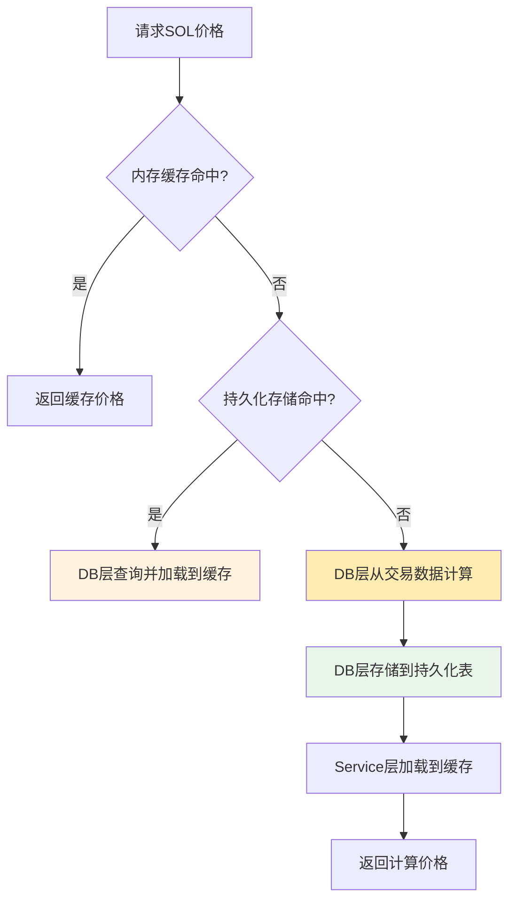
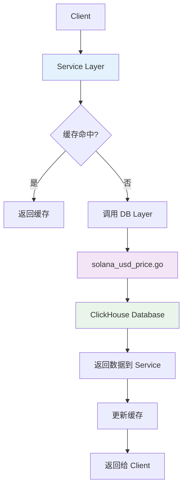

# Token Price 架构设计文档

## 概述

本文档描述了 Solana DEX 解析器中 Token 价格服务的混合架构设计，该架构结合了持久化存储和内存缓存的优势，实现了高性能的价格查询服务。采用了严格的分层架构，遵循 Go 语言的最佳实践。

## 核心设计原则

### 1. 快速读取，快速存储
- **内存缓存**: 使用有序切片 + 二分查找，O(log n) 时间复杂度
- **持久化存储**: ClickHouse 表，针对区块高度优化索引
- **混合策略**: 内存 → 持久化 → 计算，三级回退机制

### 2. 占用内存量小，节省系统资源
- **只缓存 SOL 价格**: 其他代币价格通过 SOL 折算
- **有限缓存大小**: 最多缓存 10,000,000 个价格点
- **自动内存管理**: 超出限制时自动清理最旧数据

## 架构分层

### 1. DB 层 (src/db/clickhouse/)

**文件**: `solana_usd_price.go`

**职责**: 数据库操作和数据计算
- 持久化存储的 CRUD 操作
- 从交易数据计算 SOL 价格
- 批量数据处理

**核心方法**:
```go
// 持久化存储操作
func (s *SolanaUsdPrice) GetSolanaUsdPriceAtOrBefore(db ckdriver.Conn, blockHeight uint64) (uint64, float64, error)
func (s *SolanaUsdPrice) InsertSolanaUsdPrice(db ckdriver.Conn, blockHeight uint64, usdPrice float64) error
func (s *SolanaUsdPrice) BatchInsertSolanaUsdPrice(db ckdriver.Conn, prices []SolanaUsdPrice) error

// 从原始交易数据计算
func (s *SolanaUsdPrice) GetSOLPriceFromTransactions(db ckdriver.Conn, blockHeight uint64) (float64, error)
func (s *SolanaUsdPrice) GetSOLTransactionsInRange(db ckdriver.Conn, startBlock, endBlock uint64) ([]SOLTransactionData, error)
func (s *SolanaUsdPrice) GetTokenTransactionData(db ckdriver.Conn, tokenAddress string, blockHeight uint64) (*SolanaHistoryData, error)
```

### 2. Service 层 (src/service/)

**文件**: `price_service.go`

**职责**: 业务逻辑和缓存管理
- 内存缓存策略
- 混合查询逻辑
- 对外 API 接口

**核心方法**:
```go
// 对外接口
func (ps *PriceService) GetSOLPriceAtBlock(blockHeight uint64) (float64, error)
func (ps *PriceService) GetTokenPriceAtBlock(tokenAddress string, blockHeight uint64) (float64, error)
func (ps *PriceService) BatchCalculateAndStorePrices(startBlock, endBlock uint64) error

// 缓存管理
func (pc *PriceCache) getPrice(blockHeight uint64) (float64, bool)
func (pc *PriceCache) setPrice(blockHeight uint64, price float64)
func (ps *PriceService) GetCacheStats() map[string]interface{}
```

### 3. Config 层 (src/config/)

**文件**: `constants.go`

**职责**: 系统常量定义
```go
const (
    SOL_ADDRESS  = "11111111111111111111111111111111"
    WSOL_ADDRESS = "So11111111111111111111111111111111111111112"
    USDC_ADDRESS = "EPjFWdd5AufqSSqeM2qN1xzybapC8G4wEGGkZwyTDt1v"
    USDT_ADDRESS = "Es9vMFrzaCERmJfrF4H2FYD4KCoNkY11McCe8BenwNYB"
)
```

## 数据结构

### 1. 内存缓存结构

```go
type PriceCache struct {
    BlockHeights []uint64  // 有序区块高度列表
    Prices       []float64 // 对应的价格列表
    maxSize      int       // 最大缓存大小
    mutex        sync.RWMutex // 读写锁
}
```

### 2. 持久化存储结构

```go
type SolanaUsdPrice struct {
    BlockHeight uint64  `ch:"block_height"`
    UsdPrice    float64 `ch:"usd_price"`
}

type SOLTransactionData struct {
    BlockHeight uint64  `json:"block_height"`
    QuoteAmount float64 `json:"quote_amount"`
    TokenAmount float64 `json:"token_amount"`
    UsdPrice    float64 `json:"usd_price"`
}
```

### 3. 服务主结构

```go
type PriceService struct {
    clickhouseClient ckdriver.Conn                    // 数据库连接
    solPriceCache    *PriceCache                      // 内存缓存
    solPriceDB       *clickhouse.SolanaUsdPrice       // 持久化存储
}
```

## 工作流程

### SOL 价格查询流程



### 分层调用关系



## 数据库设计

### ClickHouse 表结构

```sql
CREATE TABLE IF NOT EXISTS solana_usd_price (
    block_height UInt64,
    usd_price Float64,
    created_at DateTime DEFAULT now()
) ENGINE = MergeTree()
ORDER BY block_height
SETTINGS index_granularity = 8192;
```

## 使用示例

### 完整的使用流程

```go
// 1. 初始化服务
priceService := service.NewPriceService(db.ClickHouseClient)

// 2. 批量预处理历史数据（DB层操作）
err := priceService.BatchCalculateAndStorePrices(300000000, 300001000)

// 3. 查询SOL价格（混合策略）
solPrice, err := priceService.GetSOLPriceAtBlock(300000500)

// 4. 查询代币价格（业务逻辑处理）
tokenPrice, err := priceService.GetTokenPriceAtBlock("TokenAddress", 300000500)

// 5. 监控缓存状态
stats := priceService.GetCacheStats()
fmt.Printf("缓存大小: %d, 最大容量: %d\n", 
    stats["cache_size"], stats["max_cache_size"])
```

## 架构优势

### 1. 分层清晰

| 层级 | 职责 | 依赖 |
|------|------|------|
| Service 层 | 业务逻辑、缓存管理 | DB 层 |
| DB 层 | 数据操作、数据计算 | ClickHouse |
| Config 层 | 系统常量 | 无 |

### 2. vs 其他架构

| 特性 | 混合分层架构 | 单层架构 | 纯缓存架构 |
|------|-------------|----------|------------|
| 代码可维护性 | ✅ 高度模块化 | ❌ 耦合严重 | ⚠️ 中等 |
| 测试便利性 | ✅ 分层测试 | ❌ 难以测试 | ⚠️ 中等 |
| 性能 | ✅ 混合优化 | ❌ 数据库瓶颈 | ✅ 内存级别 |
| 数据持久性 | ✅ 永久保存 | ✅ 永久保存 | ❌ 重启丢失 |
| 资源使用 | ✅ 可控制 | ✅ 较低 | ❌ 持续增长 |

### 3. 符合 Go 语言最佳实践

- **单一职责原则**: 每层专注自己的职责
- **依赖倒置**: Service 层依赖 DB 层接口
- **开闭原则**: 易于扩展新的存储方式
- **接口分离**: 清晰的层级接口定义

## 性能指标

### 查询性能

| 场景 | 时间复杂度 | 预期延迟 | 调用路径 |
|------|------------|----------| ---------|
| 内存缓存命中 | O(log n) | < 1ms | Service → Cache |
| 持久化存储命中 | O(log n) | < 10ms | Service → DB → ClickHouse |
| 计算新价格 | O(1) | < 100ms | Service → DB → 计算 → 存储 |

### 内存使用优化

```
估算内存占用 = 缓存大小 × (8字节 + 8字节) = 10,000,000 × 16字节 = 160MB
```

## 监控和运维

### 1. 关键性能指标

```go
stats := priceService.GetCacheStats()
// 监控项:
// - cache_size: 当前缓存大小
// - max_cache_size: 最大缓存容量
// - min_block: 缓存最小区块高度
// - max_block: 缓存最大区块高度
```

### 2. 运维建议

1. **缓存监控**: 设置缓存使用率告警（建议 < 80%）
2. **数据库监控**: 监控 ClickHouse 查询性能
3. **定期预处理**: 避免高峰期实时计算
4. **分层测试**: 单独测试 DB 层和 Service 层

## 扩展计划

### 短期优化

- [ ] 添加 Redis 作为分布式缓存
- [ ] 实现配置化的缓存策略
- [ ] 添加详细的性能监控指标

### 长期规划

- [ ] 支持多币种基准价格
- [ ] 集成外部价格数据源
- [ ] 实现微服务架构

## 总结

重构后的架构具有以下关键优势：

1. **严格分层**: DB 层专注数据操作，Service 层专注业务逻辑
2. **高度模块化**: 每个层级职责清晰，易于维护和测试
3. **性能优化**: 混合存储策略，兼顾性能和持久性
4. **符合规范**: 遵循 Go 语言分层架构最佳实践

这种架构不仅解决了性能和资源的问题，更重要的是提供了可维护、可扩展、可测试的代码结构，是企业级应用的理想选择。 